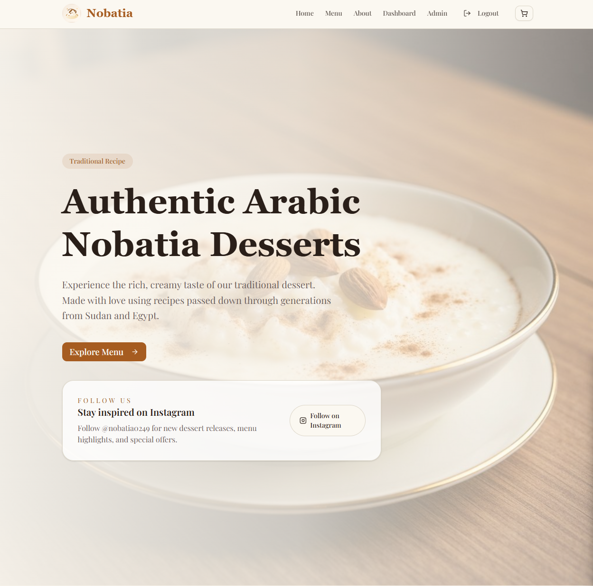
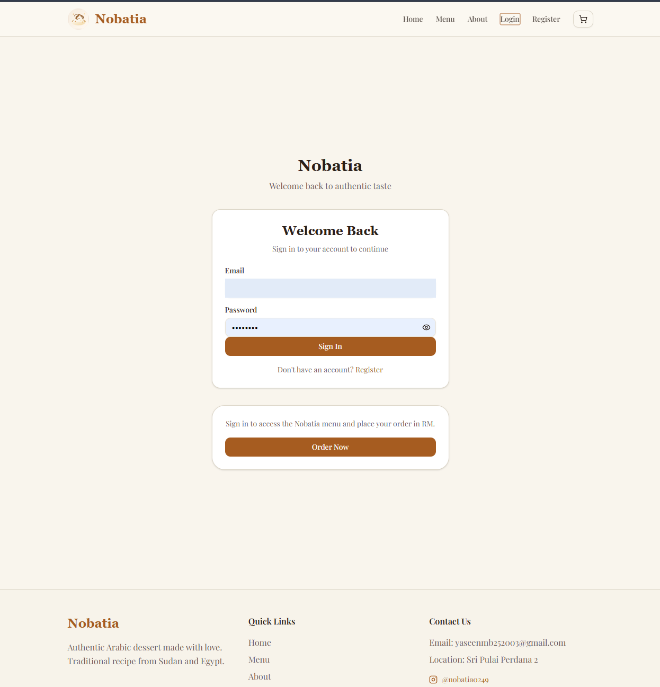
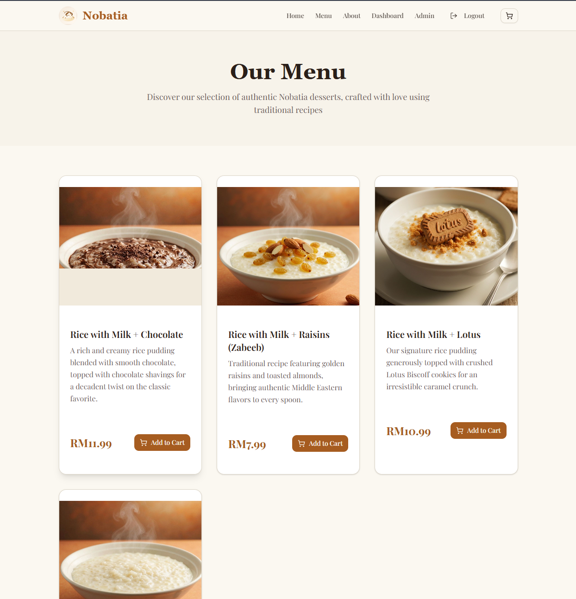
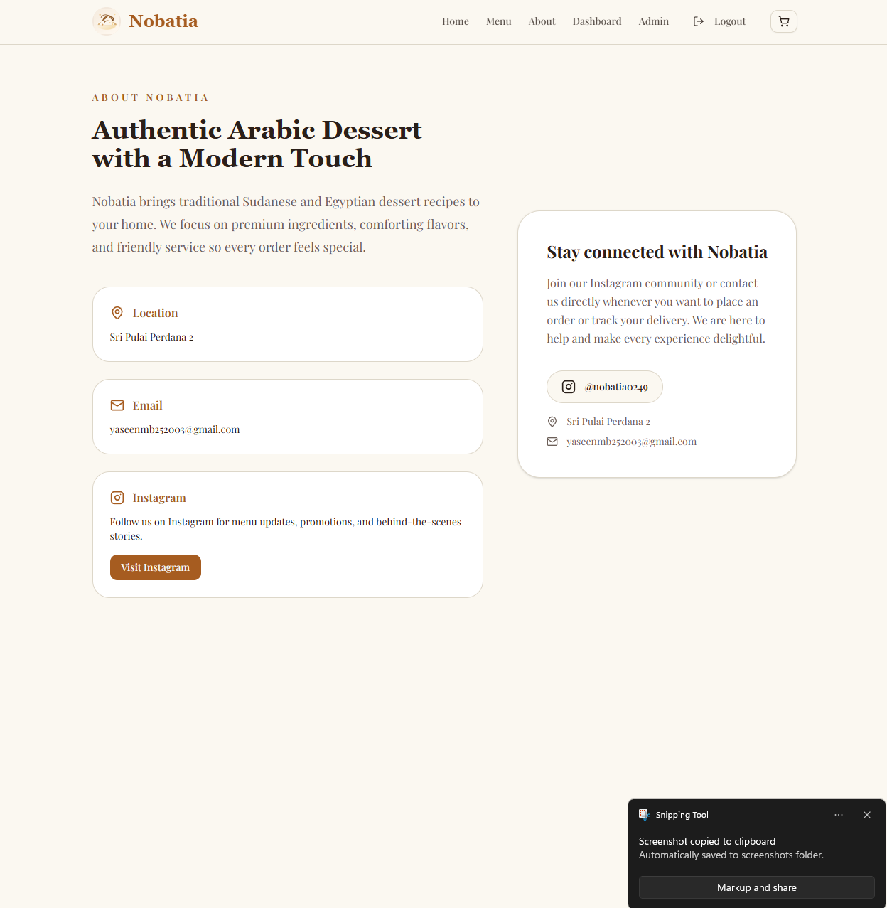
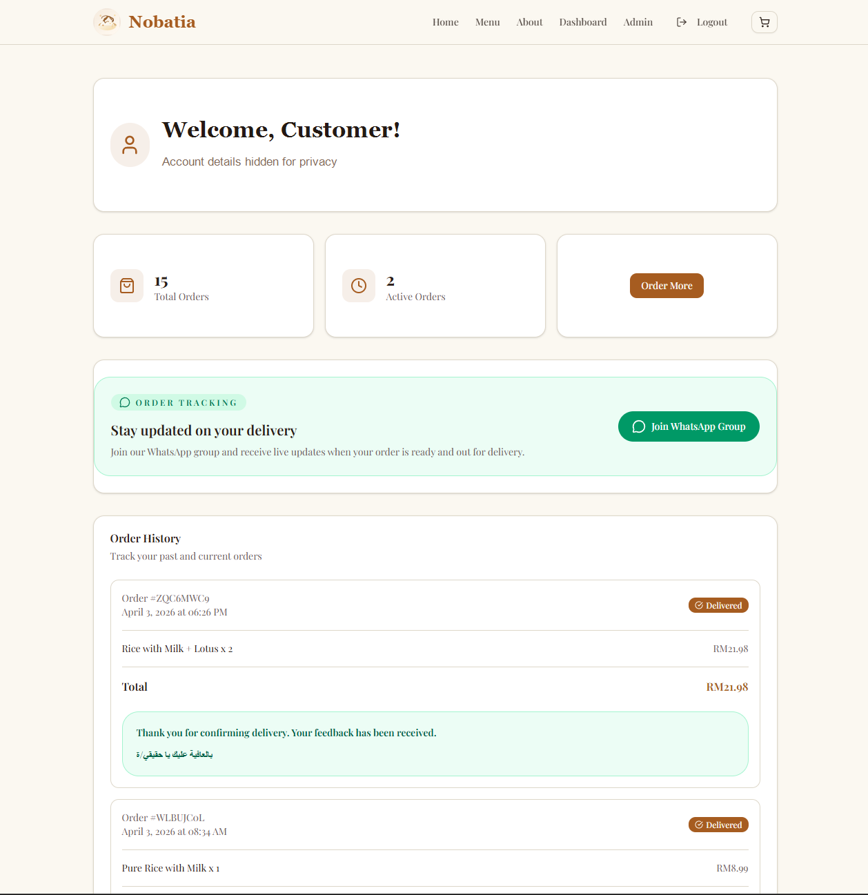
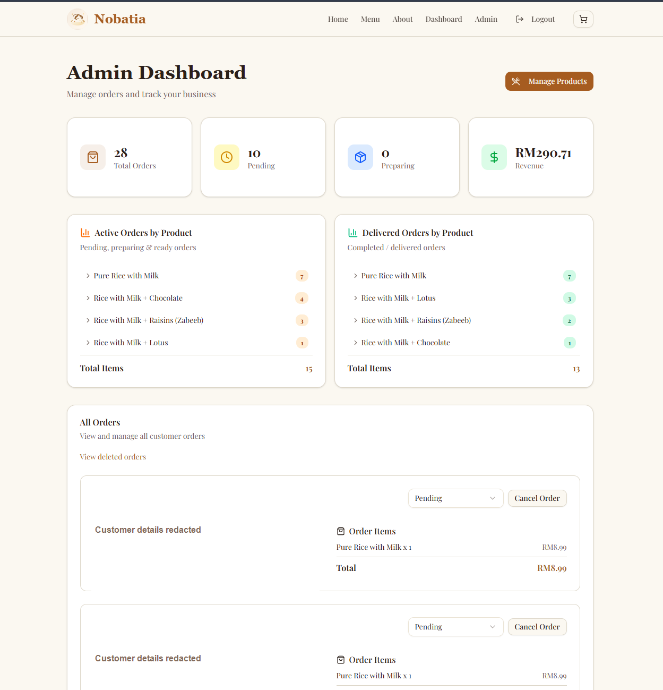
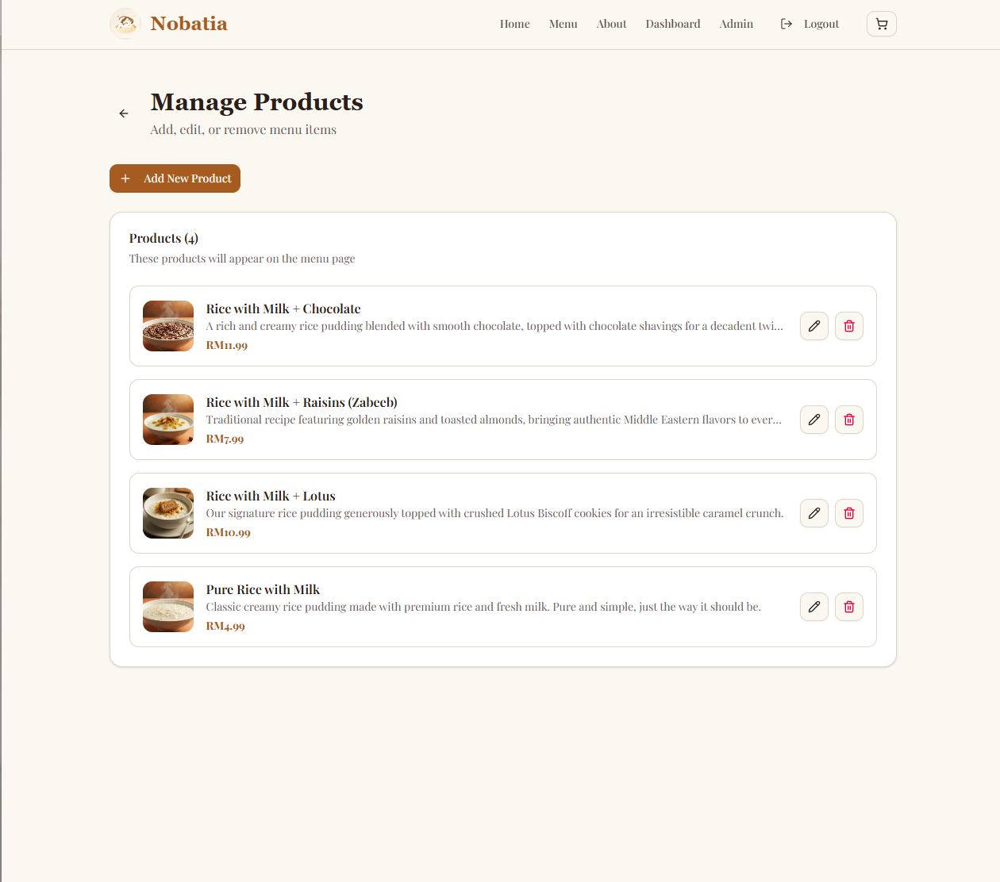

# Nobatia

Nobatia is a full-stack dessert ordering platform for authentic Sudanese and
Egyptian rice pudding. Customers can browse the menu, place orders, follow
their order history, and submit delivery feedback, while administrators can
manage products and process every order from one dashboard.



## Features

### Customer experience

- Responsive landing page, menu, about page, and shopping cart
- Email and password registration and login with Firebase Authentication
- Firestore-backed products, checkout, and order history
- Live customer dashboard with order statuses and delivery confirmation
- Feedback collection after delivery
- WhatsApp order-tracking community and Instagram links

### Administration

- Role-protected admin dashboard
- Revenue, order, and product-level summaries
- Expandable active and delivered product breakdowns
- Order status updates, cancellation reasons, and deleted-order history
- Product creation, editing, image upload, and deletion

## Screenshots

### Authentication and menu

| Login | Menu |
| --- | --- |
|  |  |

### About



### Customer dashboard



### Admin dashboard



### Product management



> Private account and customer information has been redacted from the
> screenshots.

## Tech Stack

| Area | Technology |
| --- | --- |
| Framework | Next.js 16 with App Router |
| Language | TypeScript |
| UI | React 19, Tailwind CSS 4, Radix UI, Lucide icons |
| Authentication | Firebase Authentication |
| Database | Cloud Firestore |
| Forms | React Hook Form and Zod |
| Analytics | Vercel Analytics |
| Deployment | Vercel |

## Getting Started

### Prerequisites

- Node.js 20 or newer
- npm
- A Firebase project with Authentication and Firestore enabled

### Installation

```bash
git clone https://github.com/Ymb2525003/nobatia.git
cd nobatia
npm install
npm run dev
```

Open [http://localhost:3000](http://localhost:3000) in your browser.

## Firebase Setup

1. Open the Firebase Console and select your project.
2. Under **Authentication**, enable the **Email/Password** sign-in provider.
3. Create a Cloud Firestore database.
4. Add your deployed Vercel domain under **Authentication > Settings >
   Authorized domains**.
5. Configure Firestore security rules before using the application in
   production.

The current Firebase web configuration is stored in
[`lib/firebase.ts`](lib/firebase.ts). Firebase web configuration identifies
the project but does not replace secure Firestore rules.

### Firestore collections

- `users`: customer profiles and the `isAdmin` role
- `products`: menu products, prices, descriptions, and images
- `orders`: customer details, cart items, totals, statuses, and feedback

### Add an administrator

1. Ask the administrator to register through the Nobatia application.
2. In Firebase Console, open **Firestore Database > Data > users**.
3. Open the document matching that user's Firebase UID.
4. Change `isAdmin` to the boolean value `true`.
5. Ask the user to log out and sign in again.

Do not allow customers to update their own `isAdmin` value in your Firestore
security rules.

## Vercel Deployment

Import the GitHub repository into Vercel and deploy it as a Next.js project.
The current codebase does not read any environment variables, so no Vercel
environment variables are required. Remember to add the final Vercel domain
to Firebase Authentication's authorized domains.

## Available Scripts

```bash
npm run dev
npm run build
npm run start
npm run lint
```
